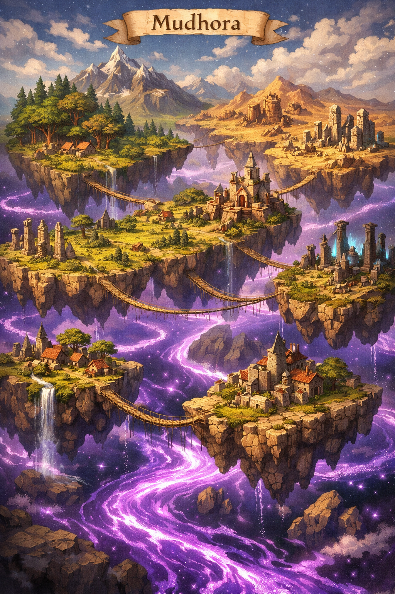
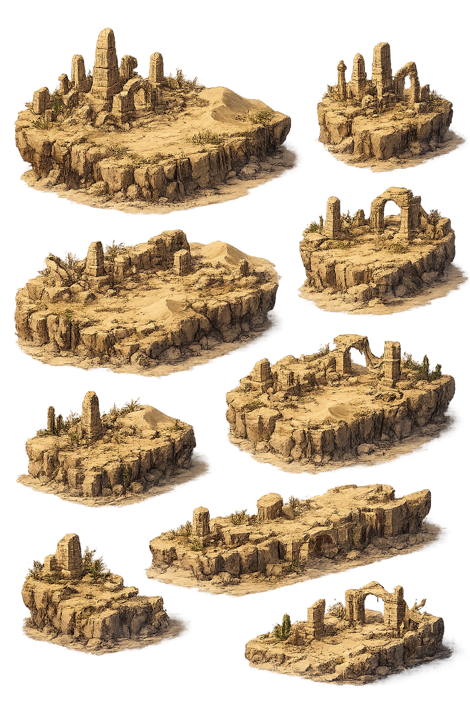
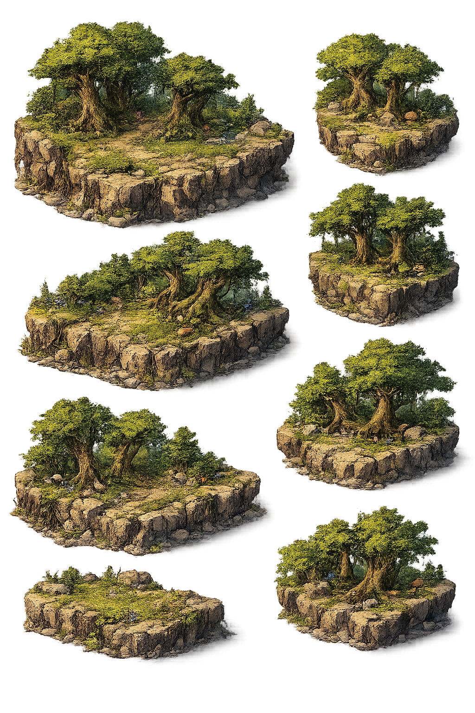
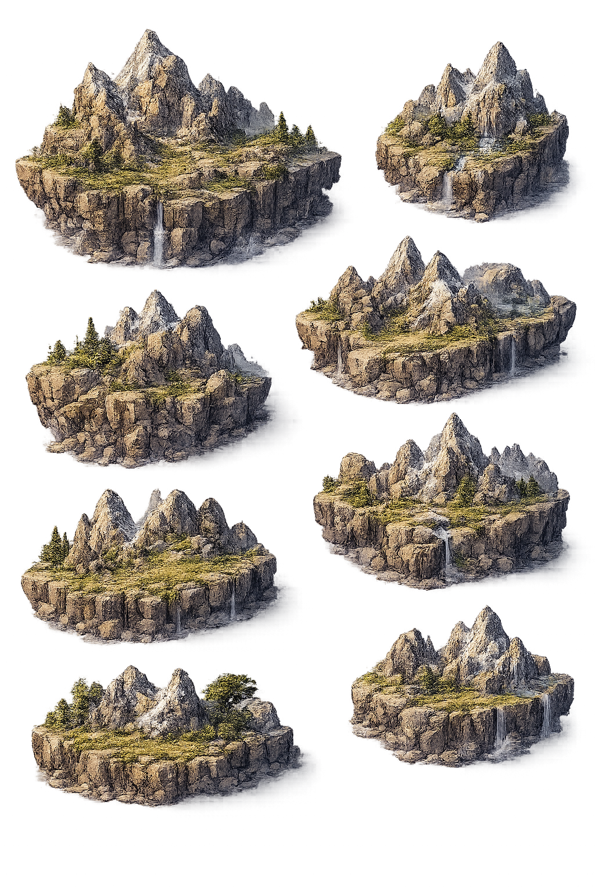
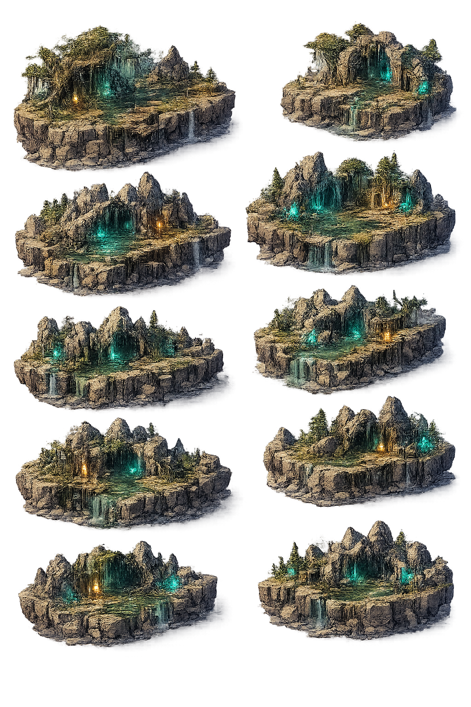
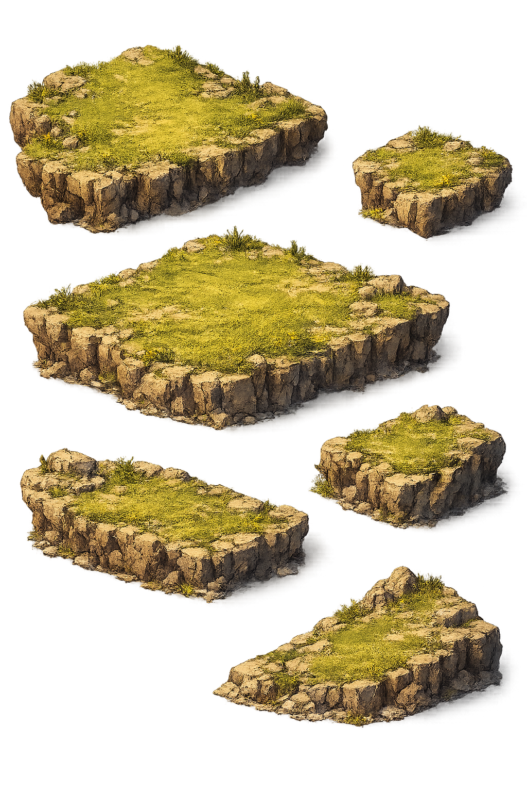
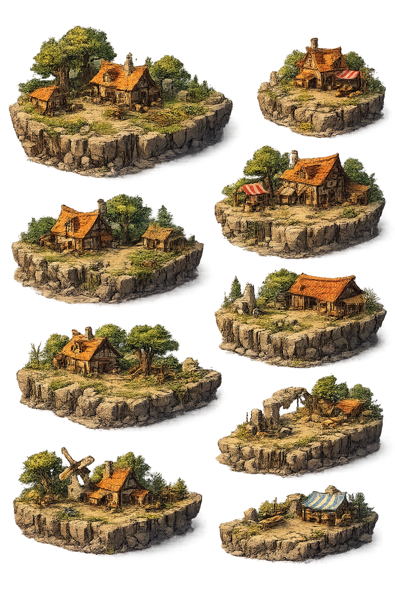
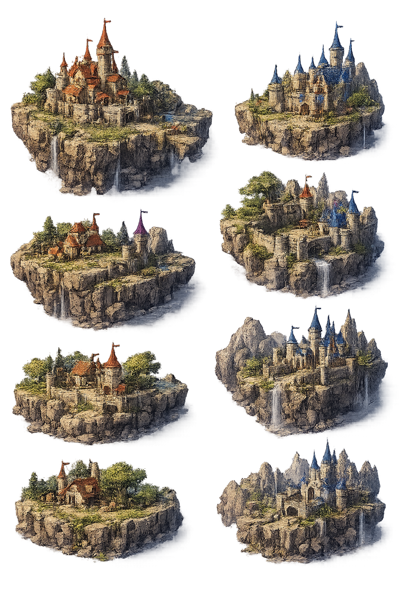
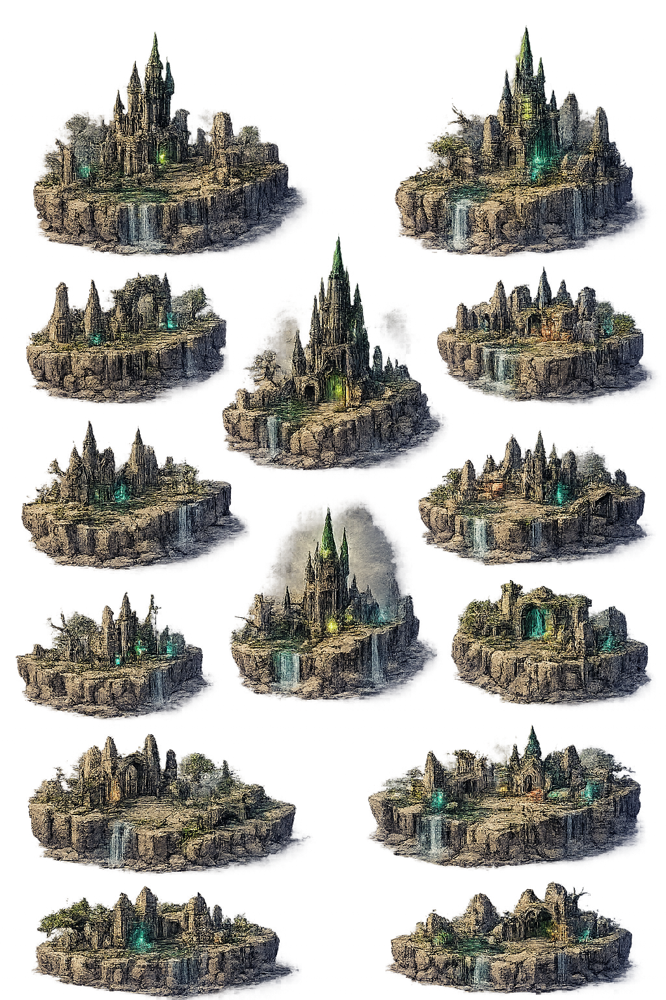
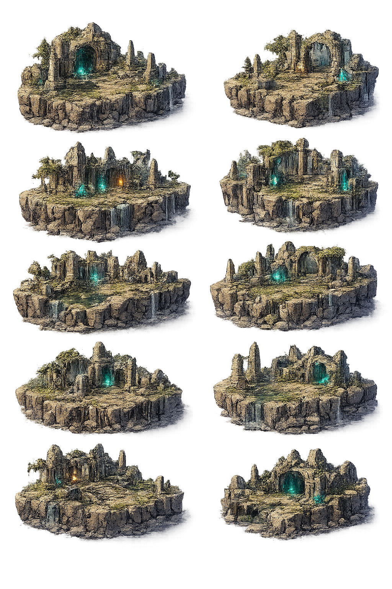

# Mudhora - O Continente Flutuante

## Visão Geral

Mudhora é um continente místico e caótico, composto por ilhas flutuantes suspensas sobre um vasto void de energia roxa. Este reino está em constante transformação, com suas ilhas mudando de posição continuamente, criando um mundo dinâmico e imprevisível. As forças arcanas que emanam do void abaixo mantêm as massas de terra suspensas, mas também causam instabilidade na estrutura do continente.

O continente é dividido em diversos biomas distintos, cada um com suas características únicas, fauna, flora e desafios. Os viajantes devem estar preparados para enfrentar as condições mutáveis do terreno, pois o que hoje é um caminho conhecido pode ser completamente diferente amanhã.

---

## O Void

O Void é o abismo de energia roxa que sustenta todo o continente de Mudhora. Esta energia arcana pulsa constantemente, emanando um brilho místico que ilumina as ilhas por baixo. O Void é a fonte do caos que mantém as ilhas em constante movimento, e poucos ousam se aproximar de suas bordas. Lendas dizem que o Void é a própria essência da magia primordial, e aqueles que caem nele nunca retornam.

**Características:**
- Energia roxa pulsante
- Força gravitacional arcana
- Fonte do caos dimensional
- Perigo mortal para quem cai

---

## Biomas de Mudhora

### Deserto

As ilhas desérticas de Mudhora são vastas extensões de areia dourada e dunas implacáveis. O calor é intenso durante o dia, e o frio é cortante à noite. Oásis raros oferecem refúgio para viajantes cansados. Antigos templos e ruínas emergem das areias, guardando segredos de civilizações há muito esquecidas.

**Características:**
- Temperaturas extremas
- Tempestades de areia
- Ruínas antigas
- Recursos minerais valiosos

### Floresta

As florestas flutuantes são densas e misteriosas, repletas de vegetação exuberante e vida selvagem. Árvores ancestrais se erguem até as nuvens, e suas raízes pendem sobre o void abaixo. A floresta é lar de criaturas mágicas e oferece abundância de recursos naturais, mas também esconde perigos nas sombras.

**Características:**
- Vegetação densa
- Fauna diversificada
- Recursos de madeira e plantas
- Visibilidade limitada

### Caverna

As ilhas de caverna são formações rochosas com vastos sistemas subterrâneos. Cristais brilhantes iluminam as profundezas, e minérios preciosos abundam nas paredes. Estas cavernas são refúgios naturais, mas também lar de criaturas que se adaptaram à escuridão. Exploradores devem ter cuidado com os túneis instáveis.

**Características:**
- Sistemas de cavernas complexos
- Minérios e cristais
- Escuridão permanente
- Criaturas subterrâneas

### Montanha

Os picos montanhosos de Mudhora se erguem majestosamente, coroados por neve eterna. Estas ilhas oferecem vistas espetaculares do continente, mas o terreno é traiçoeiro e o ar rarefeito. Fortalezas antigas foram construídas nestes picos, aproveitando-se de sua posição estratégica defensiva.

**Características:**
- Terreno elevado
- Clima frio e ventoso
- Visibilidade ampla
- Difícil acesso

### Inverno

As ilhas de inverno são cobertas por neve e gelo perpétuos. Ventanias congelantes varrem a superfície, e lagos congelados escondem perigos sob suas camadas de gelo. Apesar do ambiente hostil, criaturas adaptadas ao frio prosperam aqui, e recursos raros podem ser encontrados nas profundezas geladas.

**Características:**
- Frio extremo
- Tempestades de neve
- Superfícies escorregadias
- Recursos de gelo

### Pântano

Os pântanos flutuantes são terras úmidas e sombrias, cobertas por névoa perpétua. Águas estagnadas escondem criaturas perigosas, e o terreno traiçoeiro dificulta a navegação. No entanto, plantas raras com propriedades alquímicas crescem abundantemente neste ambiente, atraindo alquimistas e curandeiros.

**Características:**
- Terreno alagado
- Visibilidade reduzida pela névoa
- Plantas alquímicas
- Criaturas aquáticas hostis

### Planície

As planícies são vastas extensões de terra plana, cobertas por gramíneas ondulantes. Este é o bioma mais acessível e hospitaleiro de Mudhora, ideal para assentamentos e agricultura. No entanto, a falta de proteção natural torna estas ilhas vulneráveis a ataques e à exposição aos elementos.

**Características:**
- Terreno plano e aberto
- Ideal para construção
- Recursos agrícolas
- Exposição a ameaças

---

## Estruturas e Locais de Interesse

### Cidade

As cidades de Mudhora são centros de civilização e comércio. Construídas com arquitetura que desafia a gravidade, estas metrópoles flutuantes são hubs de atividade, onde comerciantes, aventureiros e estudiosos se reúnem. As cidades oferecem proteção, recursos e acesso a tecnologias avançadas.

**Características:**
- População densa
- Mercados e comércio
- Serviços avançados
- Proteção militar

### Vila

As vilas são assentamentos menores, comunidades unidas que dependem da terra e dos recursos locais. Embora menos protegidas que as cidades, as vilas oferecem um refúgio mais tranquilo e uma conexão mais próxima com a natureza. São pontos de descanso importantes para viajantes.

**Características:**
- Comunidade pequena
- Comércio básico
- Agricultura local
- Hospitalidade

### Castelo

Os castelos são fortalezas imponentes, construídas para resistir a ataques e ao caos de Mudhora. Servem como bases militares, residências de nobres e centros de poder. Suas muralhas espessas e torres altas oferecem defesa superior contra invasores e criaturas hostis.

**Características:**
- Defesas fortificadas
- Guarnição militar
- Armazéns de recursos
- Centro de poder

### Torre

As torres são estruturas verticais misteriosas, muitas vezes habitadas por magos e estudiosos. Estas construções servem como observatórios, bibliotecas e laboratórios arcanos. Do topo das torres, é possível observar o movimento das ilhas e estudar os padrões do caos.

**Características:**
- Altura estratégica
- Centro de estudos arcanos
- Observação do continente
- Isolamento

### Ruína

As ruínas espalhadas por Mudhora são restos de civilizações antigas que sucumbiram ao caos ou ao tempo. Estas estruturas deterioradas guardam tesouros esquecidos, artefatos poderosos e conhecimento perdido. No entanto, muitas ruínas são perigosas, infestadas por criaturas ou protegidas por armadilhas antigas.

**Características:**
- Estruturas antigas
- Tesouros escondidos
- Perigos desconhecidos
- História perdida

---

## A Natureza Caótica do Continente

O aspecto mais fascinante e perigoso de Mudhora é sua natureza em constante mudança. As ilhas flutuantes não permanecem estáticas; elas derivam lentamente sobre o void, alterando suas posições relativas. Este fenômeno cria diversos desafios:

- **Rotas Mutáveis**: Caminhos que existiam ontem podem não existir hoje
- **Isolamento Temporário**: Ilhas podem se afastar, isolando comunidades
- **Encontros Inesperados**: Biomas diferentes podem se aproximar, criando situações únicas
- **Oportunidades Efêmeras**: Acesso a recursos raros pode ser temporário

Os habitantes de Mudhora aprenderam a adaptar-se a esta realidade dinâmica, desenvolvendo tecnologias e magias para navegar entre as ilhas e prever seus movimentos. Pontes aéreas, portais mágicos e naves voadoras são essenciais para a sobrevivência neste mundo caótico.

---

O continente oferece aventuras ilimitadas, mas apenas os mais preparados e adaptáveis prosperam em suas terras flutuantes.