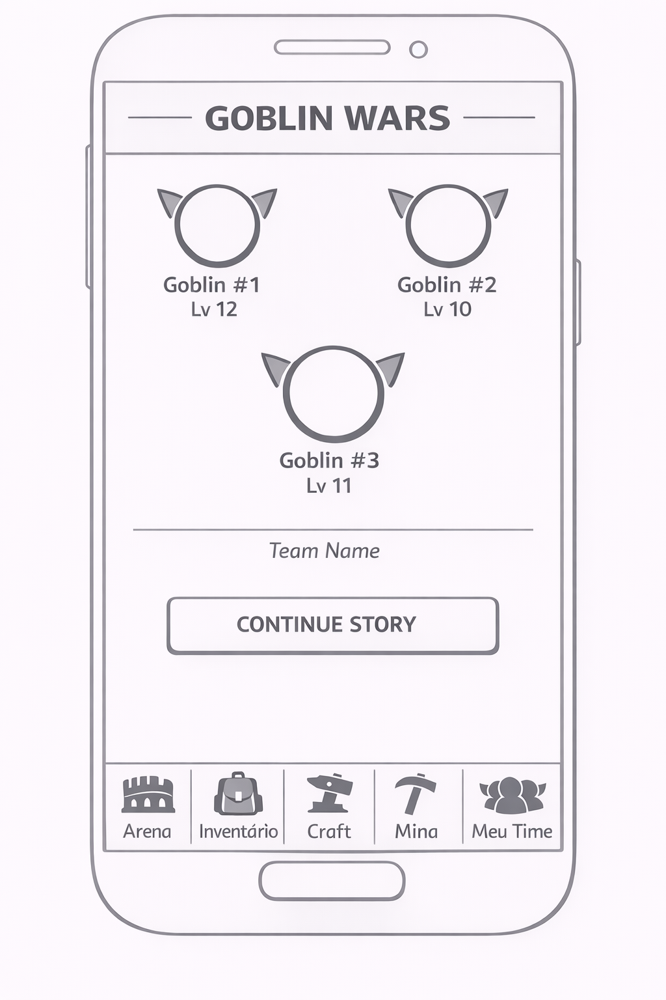
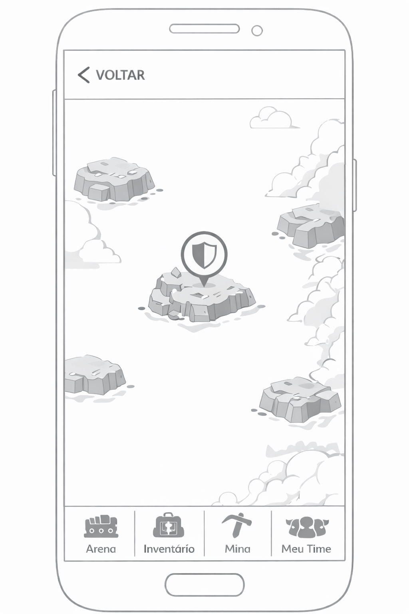
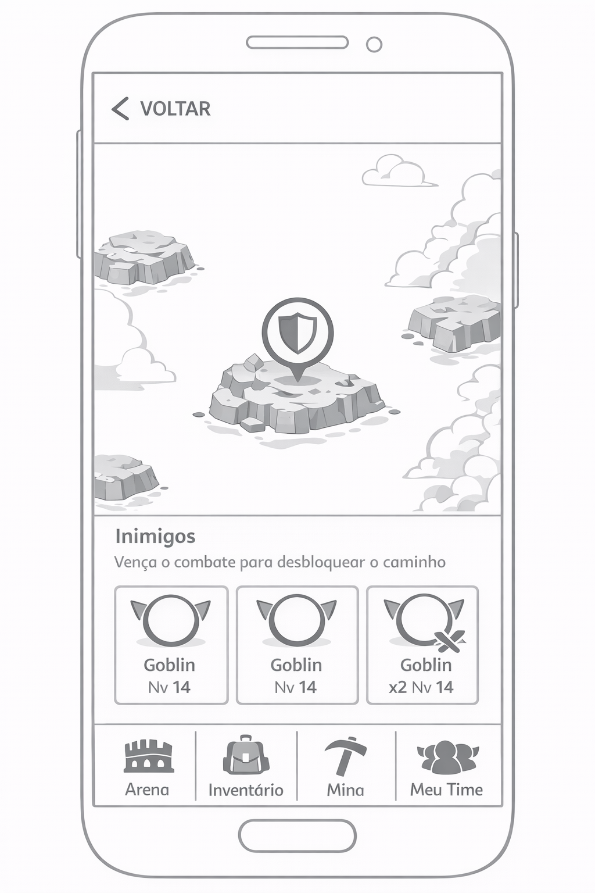
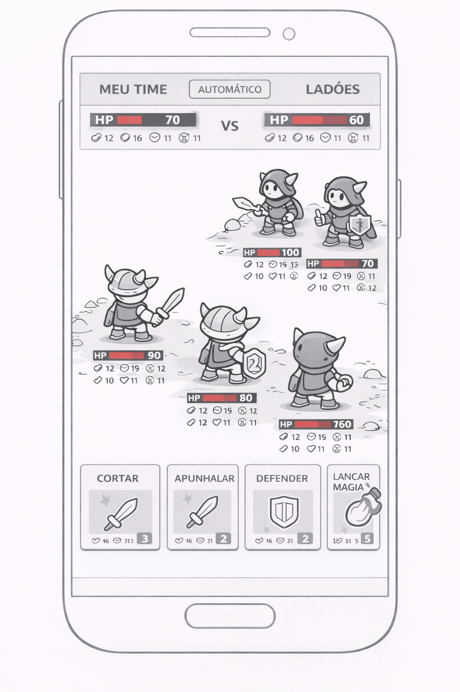
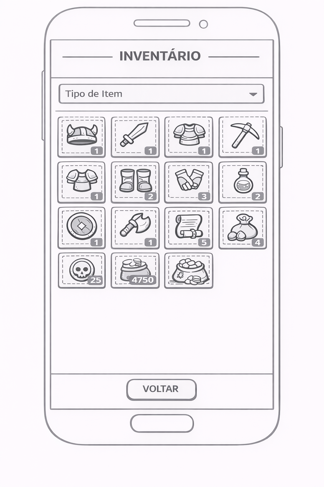
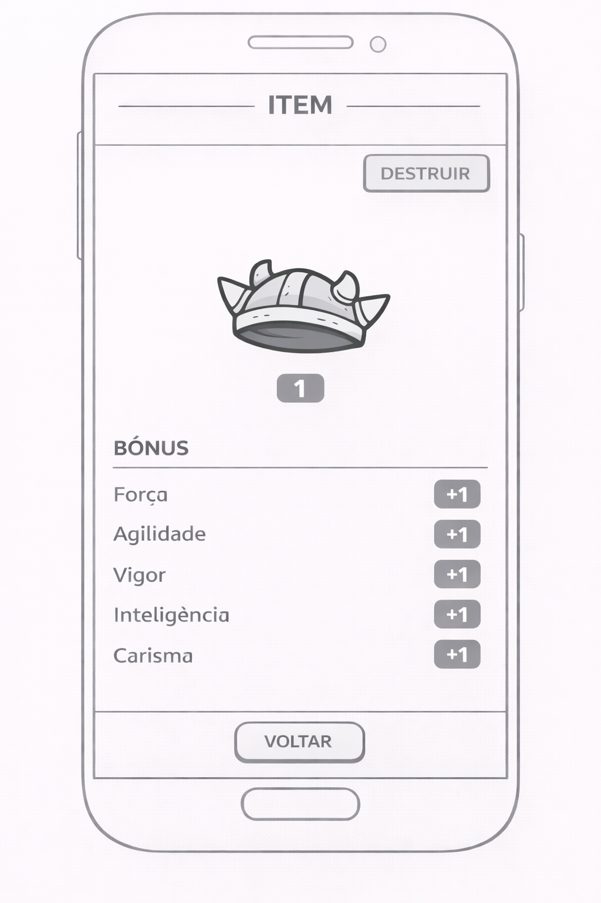
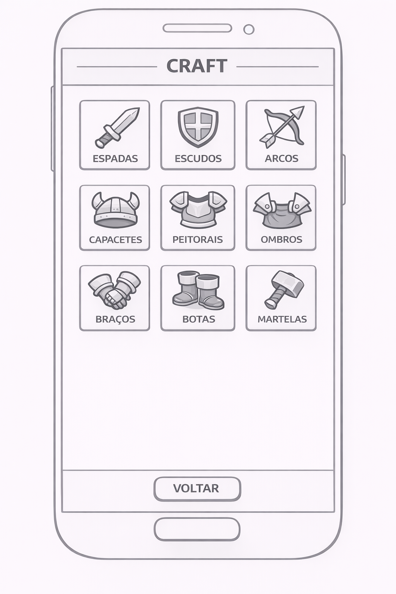
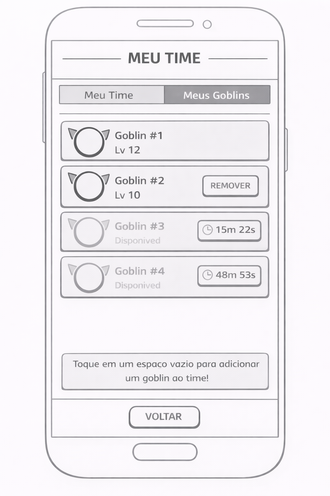

# Mobile - Especificação de Telas

## 1. Tela Inicial

### Elementos da Tela
- **Goblins do Time**: Os 3 goblins do time selecionado, exibindo nome e nível
- **Botão Principal**: "Continuar história"
- **Menu Inferior**:
  1. Arena
  2. Inventário
  3. Craft
  4. Mina
  5. Meu Time

---

## 2. Continuar História

### Navegação
- **Botão**: "Voltar" no topo
- **Mapa Isométrico Procedural**: 
  - Composto por tiles isométricos
  - Gerado de forma procedural
  - Tiles se revelam conforme o usuário se move pelo mapa
  - Áreas não exploradas permanecem ocultas/em névoa
  - Círculos com escudo marcam pontos de combate nos tiles revelados

### Interação com Inimigos

Ao clicar no escudo:
1. Zoom-in no escudo selecionado
2. Metade inferior exibe lista dos monstros oponentes com seus níveis
3. Botão "Lutar" na parte inferior direita

---

## 3. Arena

### Elementos da Tela
- **Liga Atual**: Exibe a liga na qual está (ex: Liga de Bronze 3)
- **Oponentes**: 3 opções de time para lutar, dispostos em 3 colunas
- **Posição no Ranking**: Exibe a posição do team no placar
- **Botões**:
  - "Ver placar da liga" - Lista todas as posições da liga
  - "Voltar" na parte inferior esquerda

---

## 4. Combate

### Layout da Batalha
- **Visão Isométrica**: 
  - 3 goblins na parte de baixo olhando para parte superior esquerda
  - 3 goblins oponentes olhando para a parte inferior direita
- **Topo da Tela**: 
  - Nome do time e status do oponente
  - Nome do time e status do jogador
  - Botão "Automático" no centro
- **Informações dos Goblins**:
  - Atributos e vida exibidos em cada goblin
- **Menu de Combate**: 
  - Parte inferior com opções de ataque
  - Estilo similar ao Axie Infinity

---

## 5. Inventário

### Organização
- **Grade de Itens**: Lista em 4 colunas
- **Filtro**: Combo para filtrar por tipo de item
- **Interação**: Clicar no item abre a tela de detalhes

### Tela do Item

**Elementos**:
1. Imagem do Item
2. Quantidade disponível
3. Menu superior direito:
   - Opção "Destruir"

---

## 6. Craft

### Lista de Categorias
- **Grade de Craftings**: Lista de todas as categorias de crafting em 3 colunas
  - Exemplos: Espadas, Escudos, Armaduras de Peito, etc.
- **Navegação**: Botão "Voltar"

### Tipos de Craft

Ao selecionar uma categoria:
- Exibe lista dos crafts disponíveis dentro da categoria
  - Exemplo categoria Espadas: Espada de madeira, Espada de ferro, Espada de aço, etc.
- **Itens Indisponíveis**: Aparecem em cinza

### Tela de Crafting

Ao selecionar um crafting específico:

**Informações do Item**:
- Nome do item que será craftado (ex: Espada de Ferro)
- Descrição resumida do item

**Seleção e Tempo**:
- Espaço para selecionar o goblin que irá craftar
- Tempo gasto em horas e minutos para o crafting

**Materiais Necessários**:
- Lista dos materiais que serão usados em 4 colunas com quantidades
- Mesmo modelo visual do inventário

**Botões**:
- "Craft" - Iniciar o crafting
- "Voltar"

---

## 7. Mina

### Funcionalidade
- **Propósito**: Área onde goblins que não estão em times podem extrair itens e moedas
- **Navegação**: Livre navegação, tela não exibe a mina inteira simultaneamente
- **Mecânica**:
  - Quando o goblin estiver cheio, ele para de trabalhar
  - Jogador deve clicar no goblin para colher itens e moedas mineradas

---

## 8. Meu Time

### Tabulação
Duas abas principais: "Meu Time" e "Meus Goblins"

#### Aba: Meu Time
- **Lista do Time**: 3 goblins selecionados com botão de remover
- **Interação**: Clicar em um goblin abre a tela de detalhes
- **Espaços Vazios**: Ao clicar, exibe lista de goblins disponíveis

#### Lista de Goblins Disponíveis

- Lista completa de goblins
- Goblins indisponíveis aparecem em cinza
- Exibe tempo restante para ficarem disponíveis

---

## 9. Tela do Goblin

### Layout
- **Visualização**: Imagem animada do goblin à direita
- **Slots de Equipamento**:
  - Capacete
  - Ombros
  - Mão direita
  - Mão esquerda
  - Arma reserva
  - Peito
  - Braços
  - Pernas

### Funcionalidades
- **Equipamentos**: Clicar em um slot exibe lista de equipamentos disponíveis no inventário
- **Status**: Exibe todos os atributos do goblin:
  - Força
  - Agilidade
  - Vigor
  - Inteligência
  - Carisma
- **Navegação**: Botão "Voltar"