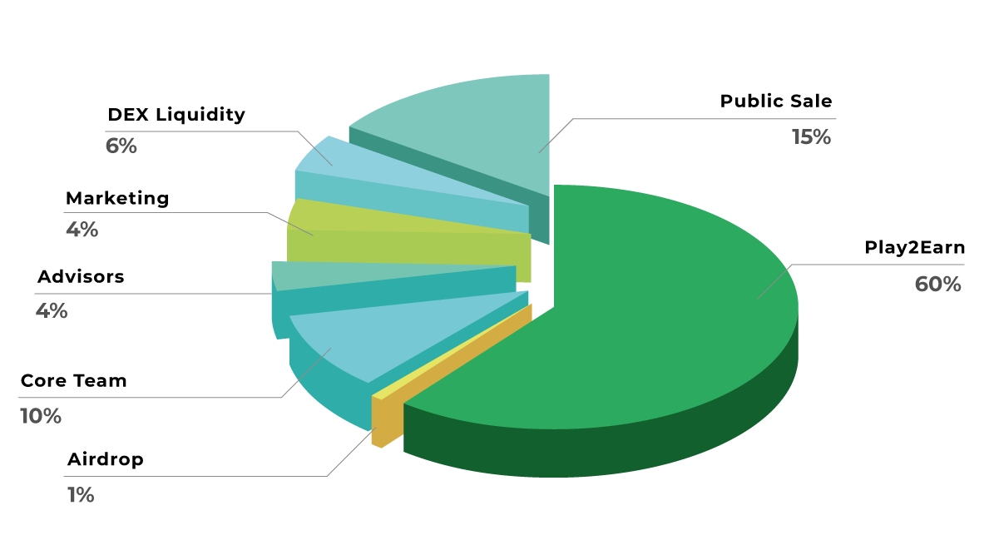

# Tokenomics

## 💰 Goblin Wars Economy

To understand **Goblin Wars** economy, it’s necessary to understand it’s based on **cryptocurrencies**, consisting of tokens.\
👾 Goblins themselves and their equipment are **NFTs (non-fungible tokens)** – they are collectible and unique.\
The currency that creates them is a **BEP20 token**.

***

### 📊 Token Issuance

The **maximum issuance** is capped at **300,000,000 tokens**, and this value will **never be exceeded**.

<figure><figcaption></figcaption></figure>

***

### 📦 Token Allocation

| 📌 Allocation    | 💯 Percent | ⏳ Vesting Period |
| ---------------- | ---------- | ---------------- |
| 🕹️ Play2Earn    | 60%        | 20 months        |
| 🎁 Airdrop       | 1%         | 6 months         |
| 👨‍💻 Core Team  | 10%        | 50 months        |
| 🧠 Advisors      | 4%         | 20 months        |
| 📢 Marketing     | 4%         | 20 months        |
| 💧 DEX Liquidity | 6%         | -                |
| 🛒 Public Sale   | 15%        | 5 months         |

***

### 🕹️ Play to Earn Wallet (60%)

**Wallet:** `coming soon`\
80% Locked, released monthly until April **2028**.\
20% to reward players from the beginning.

🔒 **Lock URL:** `coming soon`

***

### 💧 DEX Liquidity Wallet (6%)

**Wallet:** `coming soon`\
The project did not have a private sale; initially nobody concentrates many tokens.\
As a result, **initial liquidity is low**. This wallet gradually sells tokens and converts them to project liquidity.

🔒 **Liquidity Lock URLs:**

* `coming soon`
* `coming soon`
* `coming soon`

Liquidity is locked for a shorter period because the token smart contract is under audit.\
Once complete, liquidity will be locked for **at least one year**.

***

### 🛒 Public Sales Wallet (15%)

**Wallet:** `coming soon`\
Project development costs must come from this portfolio.\
The initial costs are being borne by the developers themselves.\
100% Locked, released monthly until **30 DEZ 2026**.\
Tokens will be sold once the liquidity pool reaches the desired level.

🔒 **Lock URL:** `coming soon`

***

### 📢 Advisors & Marketing Wallet (8%)

**Wallets:**

* `coming soon`
* `coming soon`

Budget for both **advisors and marketing** is included here.\
100% Locked, releasing monthly until **30 Sep 2028**.

🔒 **Lock URL:** `coming soon`

***

### 👨‍💻 Core Team (10%)

**Wallet:** `coming soon`\
This is the project developers' wallet.

* 99% Locked, released monthly until **31 Mar 2028**
* 1% used for personal game testing and in-game actions.

🔒 **Lock URL:** `coming soon`

***

### 🎁 Airdrop Wallet (1%)

**Wallet:** `coming soon`\
Wallet with budget for **airdrops and promotions**.\
100% Locked, released monthly for up to **six months** from the beginning of the project.

🔒 **Lock URL:** `coming soon`

***

### 🔥 Burning Pool

**Wallet:** `coming soon`\
Receives tokens from:

* GOBOX openings
* Breeding
* Fusion
* Destroyed NFTs

Tokens are **burned periodically** to reduce supply.

***

### 🧪 Devs Wallets in Game

* `coming soon`
* `coming soon`
* `coming soon`
* `coming soon`

Used by the development team to **interact with and test the game**.

***

### 💼 Withdrawal Wallet

**Wallet:** `coming soon`\
A **hot wallet**, kept with few tokens and BNB for handling deposits and withdrawals.

***

### ✅ And When Is It Over?

The economy will generate value through:

* 🧾 **5% fees** on sales of Goblins, Items, and NFTs in the Marketplace
* 🏞️ **Land sales** (future feature)
* 📦 **GOBOX** and **GOBI token sales**
* 🪙 Token allocation as detailed above

***

🧠 *Built with transparency and value in mind. Goblin Wars is designed to reward the community while ensuring long-term sustainability.* ⚔️
