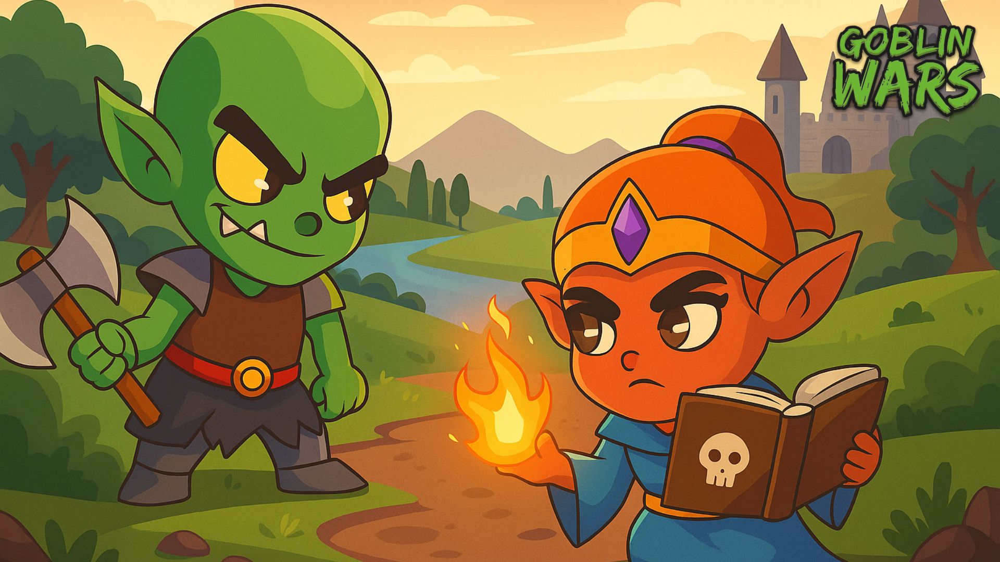

# Lore

## 🧙‍♂️ A Terra de Mudhora

🪄 *Você assumirá o papel de um dos senhores da guerra magos tentando conquistar a terra de Mudhora, com magia negra invocando exércitos de subordinados em seu caminho de destruição mútua.*

<figure><figcaption></figcaption></figure>

***

### 🧛‍♂️ De Humanos a Goblins

⚔️ *Inicialmente usando humanos, que começaram a se recusar a participar da destruição adicional da terra, os senhores da guerra mudaram seus jogos e começaram a recrutar subordinados goblins — afinal, que outra criatura guerreira tem mais potencial para ganância e destruição do que goblins?*

⛏️ *Trabalhadores incansáveis por natureza (sem julgamentos sobre sua natureza e objetivos aqui, ok?) esta espécie é capaz de dominar campo de batalha, colheita de recursos e habilidades de criação — tornando-os os apoiadores mais naturais dos magos.*

***

### 🧬 Goblins: Caminhos de Potencial

🔮 *Cada goblin representa um caminho inexplorado cheio de variáveis e potencial.*\
🎲 *Será que seu mais novo goblin dominará habilidades de batalha, será um coletor de recursos, artesão ou comerciante?*\
🧭 *Isso depende da genética e da forma como você o guiará.*

***

### 📖 Expandindo o Lore

🗺️ *Os jogadores conhecerão cada vez mais sobre a vida dos goblins e outros seres em Mudhora através de missões geradas por nosso algoritmo de missões e através de missões periódicas com o objetivo de ampliar seu lore.* 

 

---

[← Anterior: Goblin Wars](GOBLINWARS.md) | [📚 Índice](README.md) | [Próximo: Metaverso →](METAVERSE.md)
