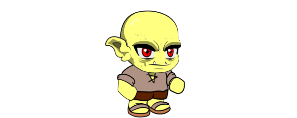

# Caverna

### Goblins da Caverna

Goblins da caverna são criaturas albinas, sombrias, de força vital e aparência animal. 🌑🐾 Como vivem isolados, são perturbados, seus sentidos altamente desenvolvidos. 👁️🧠

Como o Goblin da Floresta, eles estão altamente ligados à magia, mas menos ágeis e notáveis. 🔮⚡👤

---

[← Anterior: Deserto](RACE-DESERT.md) | [📚 Índice](README.md) | [Próximo: Montanha →](RACE-MOUNTAIN.md)
