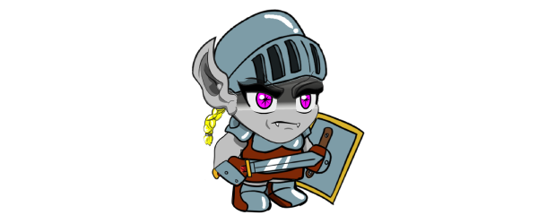

# Sombrio

<figure><figcaption>
Elite de goblins arrogantes que se acham superiores aos outros
</figcaption></figure>

### Goblins Sombrios

Eles são verdadeiros goblins sombrios, obscuros, com pele cinza, cabelo claro e olhos rosa. ⚫👁️‍🗨️🌸

Apesar de seu ar de superioridade, eles possuem poder carismático e a força é seu maior atributo. 💪✨😌

Eles geralmente são lentos e inteligentes. 🐢🧠
